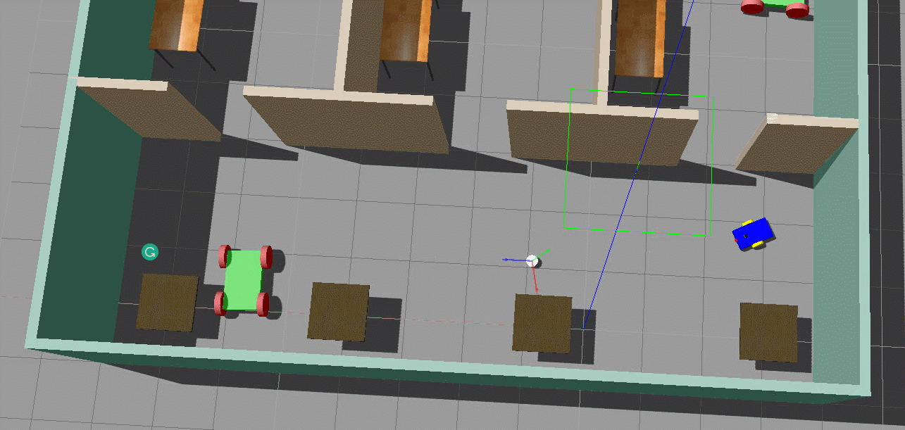

# Robotics : GO Chase It!
This project is part of my robotics nano degree of[ Udacity](https://www.udacity.com/course/computer-vision-nanodegree--nd891). 
    
    
### Examples

+ **A robot chases a white ball**
   
   
   
   
## Important files
- **<?>** : ?

    
## Installation and usage
Clone the repository
```sh
$ cd <your workspace folder>
$ git clone https://github.com/embmike/RobotND-Go-Chase-It.git
```
    
    
## Licence
This project is licensed under the terms of the [](https://opensource.org/licenses/MIT)
