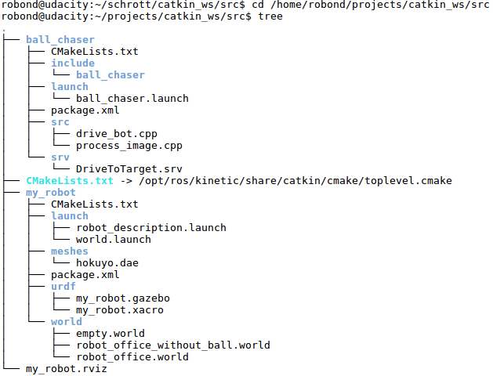

# Robotics : GO Chase It!
A robot chases a white ball. The program runs in the robot simulation [Gazebo](http://gazebosim.org/). The software is programmed in C++ and that uses the Robot Operating System [ROS]( https://www.ros.org/).    
    
This project is part of my robotics nano degree of[ Udacity](https://www.udacity.com/course/robotics-software-engineer--nd209). 

    
### Examples

+ **A robot chases a white ball**
   
   
   
   
## Important files
- /my_world/ : the ROS package with the roboter simulation
- /ball_chaser/ : the ROS package with the source code
- /ball_chaser/**drive_bot.cpp** : the ROS node that drives the robot to the white ball
- /ball_chaser/src/**process_image.cpp** : the ROS node that subscribe to the robot’s camera images and analyze them to determine the position of the white ball
- /ball_chaser/srv/**DriveToTarget.srv**: the publishes messages containing the velocities for the wheel joints
- /ball_chaser/**CMakeLists.txt** : the catkin make file

   
### File structure
 

    
## Installation and usage
Create and initialize catcin_ws
```sh
$ cd <your workspace folder>
$ mkdir -p /<your workspace folder>/catkin_ws/src
$ cd /<your workspace folder>/catkin_ws/src
$ catkin_init_workspace
```
    
Clone the repository
```sh
$ git clone https://github.com/embmike/RobotND-Go-Chase-It.git
```
    
Build packages
```sh
$ cd /<your workspace folder>/catkin_ws
$ catkin_make
$ git clone https://github.com/embmike/RobotND-Go-Chase-It.git
```
    
Launch the robot inside the world
```sh
$ cd /<your workspace folder>/catkin_ws
$ source devel/setup.bash
$ roslaunch my_robot world.launch
```
In RViz open configuration: File > Open Config > ```/<your workspace folder>/src/my_robot.rviz > Open```

Run drive_bot and process_image in a new terminal
```sh
$ cd /<your workspace folder>/catkin_ws
$ source devel/setup.bash
$ roslaunch ball_chaser ball_chaser.launch
```  
    
Visualize in a new terminal
```sh
$ cd /<your workspace folder>/catkin_ws
$ source devel/setup.bash
$ rosrun rqt_image_view rqt_image_view 
```
Now place the white ball in the field of view of the robot's camera. The robot should now move in the direction of the ball
       
## Licence
This project is licensed under the terms of the [](https://opensource.org/licenses/MIT)
