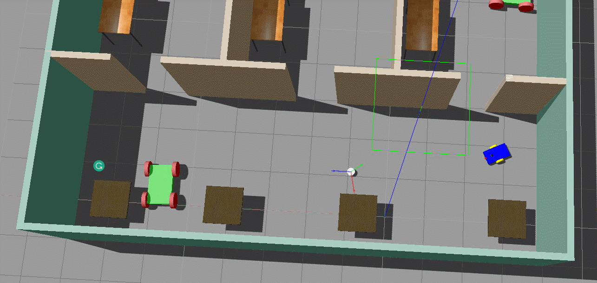
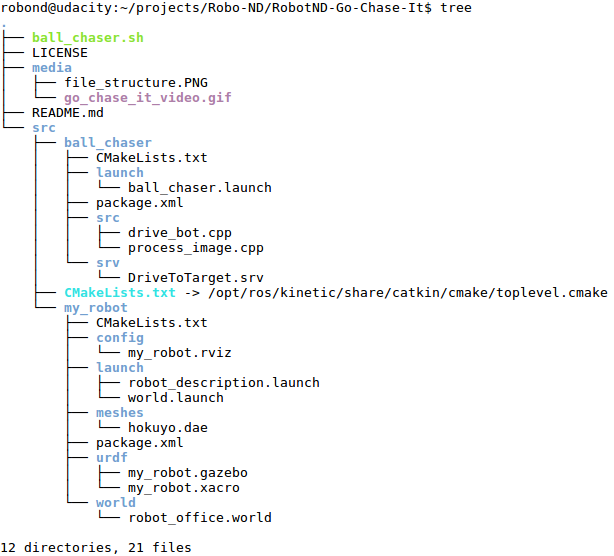

# Robotics : Go Chase It!
A robot chases a white ball. The program runs in the robot simulation [Gazebo](http://gazebosim.org/). The software is programmed in C++ and uses the robot operating system [ROS]( https://www.ros.org/).
    
This project is part of my robotics nano degree of[ Udacity](https://www.udacity.com/course/robotics-software-engineer--nd209). 

<br>

### Examples

+ **A robot chases a white ball**



## Important files
- /my_world/ : the ROS package with the roboter simulation
- /ball_chaser/ : the ROS package with the source code
- /ball_chaser/**drive_bot.cpp** : the ROS node that drives the robot to the white ball
- /ball_chaser/src/**process_image.cpp** : the ROS node that subscribe to the robot’s camera images and analyze them to determine the position of the white ball
- /ball_chaser/srv/**DriveToTarget.srv**: the publishes messages containing the velocities for the wheel joints
- /ball_chaser/**CMakeLists.txt** : the catkin make file

<br>

### Project tree
 

<br>
  
## Installation and usage
***The application runs on Ubuntu with ROS installed.***

Clone the repository
```sh
$ cd <your workspace folder>
$ git clone https://github.com/embmike/RobotND-Go-Chase-It.git
```
 
Build packages
```sh
$ cd /<your workspace folder>/RobotND-Go-Chase-It
$ catkin_make
```
 
Launch the robot inside the world and run drive_bot and process_image
```sh
$ cd /<your workspace folder>/RobotND-Go-Chase-It
$ chmod +x cd ball_chaser.sh
$ ./ball_chaser.sh
```

Now place the white ball in the field of view of the robot's camera. The robot should now move in the direction of the ball.

<br>

## Licence
This project is licensed under the terms of the [](https://opensource.org/licenses/MIT)
